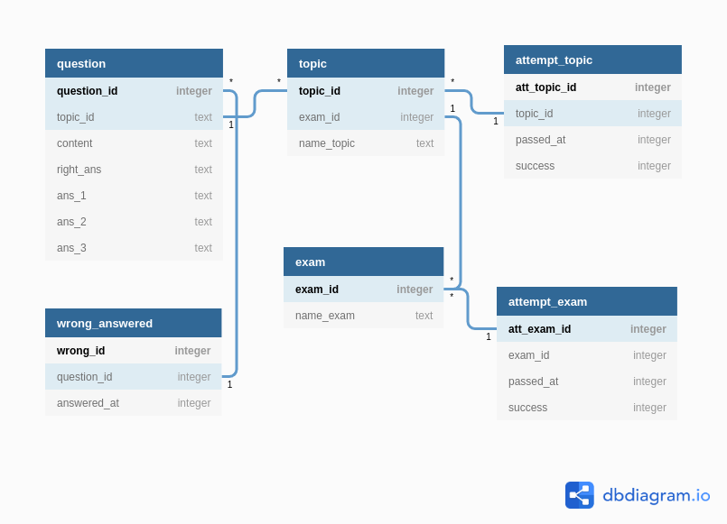
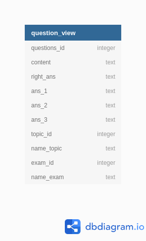

# MiningQuiz
Приложение помогает подготовиться к экзамену по Охране труда и Правилам по общеспечению промышленной безопасности на рудниках Старобинского месторождения калийных солей при разработке подземным способом.
####  Имеется 4 режима работы:
- режим экзамена
- режим решения каждой темы отдельно
- режим решения вопросов, на которые были даны неправильные ответы
- режим поиска вопроса

В приложении имеется статитика количества сданных/не сданных экзаменов(попыток), количество правильно/неправильно отвеченных вопросов.
## Сокращения:
__ОТ__ - Охрана труда;
__ПпОПБ__ - Правила по обеспечению промышленной безопасности;

## Детали реализации:
#### 1. Стек технологий:
* 1.1 платформа - _Android_;
* 1.2 работа с локальной СУБД -  _SQLiteOpenHelper_;
* 2.3 DI - _Hilt_;
* 3.4 реактивный фреймворк - _Kotlin Flows_;
* 3.5 навигация - _Jetpack Navigation Component_;
* 3.6 тестирование - _JUnit 4, Espresso_;
* 3.7 логирование - _Timber_;

#### 2. Верстка:
Для навигации в приложении используется _BottomNavigation_.
* 2.1 Экраны:
   * 2.1.1 - _HomeFragment_ - home screen. Приветствие, краткое руководство пользования программой.
   * 2.1.2 - _QuizListFragment_ - на данном экране используется ViewPager2 и TabLayout.
     Закладки:
      * 2.1.2.1 - _ExamsFragment_ - "Экзамены" - список экзаменов: экзамен по ОТ и экзамен по ПпОПБ;
      * 2.1.2.2 - _TopicsListFragments_ - "Темы" - список тем для экзамена;
      * 2.1.2.3 - _MistakesFragment_ - "Ошибки" - список ошибок, допущенных при прохождении экзаменов.
   * 2.1.3 - _StatisticsFragment_ - экран статистики.
   * 2.1.4 - _PreviewGameFragment_ - экран превью экзамена.
   * 2.1.5 - _GameFragment_ - экран прохождения экзамена.
   * 2.1.6 - _CongratsFragment_ - экран с поздравлениями, если экзамен сдан успешно.
   * 2.1.7 - _FailedFragment_ - экран, уведомляющий, что экзамен не сдан.

#### 3. Схема БД:
###### 3.1 - логическая схема базы данных:

Для сокращения длины текста SQL запросов из приложения, и просто для удобства, в базе создано следующее _Представление(_View_)_:

  